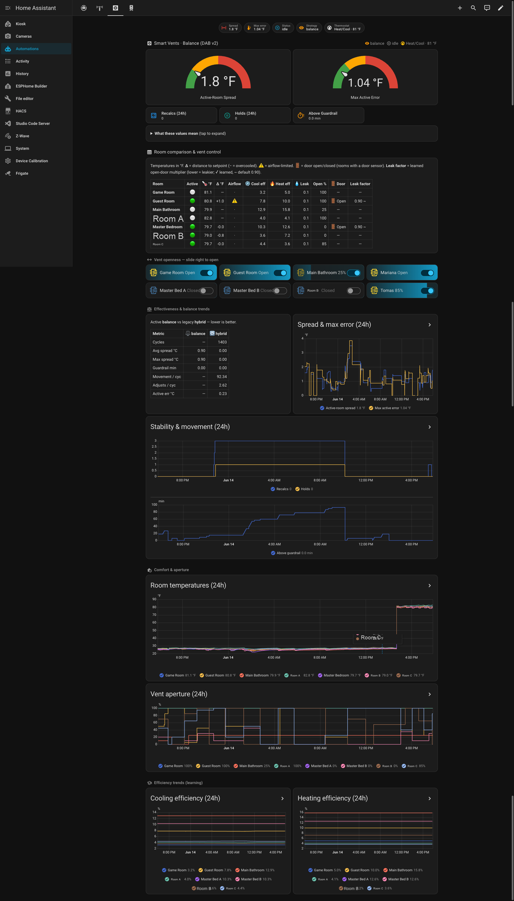

<div align="center">

# 🌡️ HVAC Vent Optimizer

### Even out the temperature in every room — automatically.

A Home Assistant integration that learns how each of your rooms heats and cools, then continuously balances your smart (or manual) vents so the whole house reaches the setpoint **together** — instead of freezing the room nearest the thermostat while the far bedroom never catches up.

[](https://github.com/hacs/integration)
[](https://github.com/ljbotero/hvac-vent-optimizer/actions/workflows/hassfest.yml)
[](https://github.com/ljbotero/hvac-vent-optimizer/actions/workflows/quality.yml)
[](https://github.com/sponsors/ljbotero)

</div>

---

## The problem

Most central HVAC systems have **one thermostat in one room**. That room hits the target temperature and the system shuts off — long before the rooms farthest from the air handler catch up. The result is the classic "the office is an icebox but the back bedroom is always 3 °C too warm" problem.

Smart vents *can* fix this, but only if something decides **how far to open each vent, and when**. Vendor apps mostly chase each room's setpoint independently, which actually makes the spread worse: the most efficient room overshoots and ends the cycle early.

## What this does differently

HVAC Vent Optimizer optimizes for the metric that actually matters: the **temperature spread between your rooms**.

> Its goal is to **minimize the difference between the warmest and coolest active room**, anchored on your thermostat's setpoint — while moving vents as little as possible and never starving the system of airflow.

It does this with **synchronized convergence**: every active room is throttled so it reaches the setpoint at the *same time as the slowest room*. No room overcools early, the cycle runs until the laggard catches up, and the whole house lands together.

<div align="center">



*The optional Smart Vents dashboard — per-room comparison, live vent control, and learning/efficiency trends.*

</div>

## Highlights

- 🎯 **Spread-minimizing balancing** — the `balance` strategy (a.k.a. *DAB v2*) closes the gap between your warmest and coolest rooms instead of letting the thermostat room win.
- 🧠 **It learns your house** — per-room, per-mode (heating *and* cooling) efficiency, per-vent airflow curves, and a learned **per-room door-leakage** factor. No manual tuning, no guessing duct sizes.
- 🌀 **Airflow safety floor** — never closes so many vents that it starves the blower or freezes a coil. This is a hard, inviolable limit.
- 🔧 **Move less, last longer** — a deadband/hold model avoids constant micro-adjustments, reducing vent wear and noise.
- 🏠 **Works with or without smart vents** — full [Flair](https://flair.co) support (vents, pucks, rooms), *or* **Manual mode** that recommends an aperture for any vent using just a thermostat and a temperature sensor.
- 📊 **Deep observability** — sensors for active-room spread, max error, holds/recalculations, per-room efficiency, and learned door factors, so you can actually see what it's doing.
- ⚙️ **100% UI-configured** — set up through the config flow; tune everything in the options flow. No YAML required.
- 🔒 **Local-first logic, no extra cloud** — all decision-making runs inside Home Assistant. (Flair hardware itself is cloud-polled via Flair's API; Manual mode needs no cloud at all.)
- 🧪 **Seriously tested** — 700+ unit and property-based tests, plus an offline thermal simulator used to validate the algorithm.

## How it works

```
        ┌─────────────┐     learns      ┌──────────────────────────┐
        │ Thermostat  │  ─────────────▶ │  Per-room efficiency      │
        │ + room temps│                 │  Per-vent airflow curve   │
        └─────────────┘                 │  Door-leakage factor      │
               │                        └──────────────────────────┘
               ▼                                     │
     ┌───────────────────┐   synchronized   ┌────────▼─────────┐
     │ Which room is the │   convergence    │ Target vent % per │
     │ slowest to reach  │ ───────────────▶ │ room, clamped by  │
     │ the setpoint?     │                  │ the safety floor  │
     └───────────────────┘                  └────────┬─────────┘
                                                      ▼
                                          opens/closes your vents
```

1. **Observe** — every active heating/cooling cycle, it samples room temperatures and how fast each room is changing.
2. **Learn** — it updates each room's heating/cooling efficiency, the vent→airflow relationship, and how much an open door changes a room's rate.
3. **Balance** — it finds the bottleneck room and throttles the faster rooms so everyone arrives together, then applies the result subject to the airflow safety floor and movement deadband.
4. **Adapt** — context (time of day, outdoor temperature band, occupancy, doors) nudges the model so it behaves sensibly across conditions.

It degrades gracefully: on a fresh install, before anything is learned, it uses safe defaults and behaves conservatively.

## Requirements

- Home Assistant (config-flow capable, recent release recommended).
- A thermostat entity per HVAC system (`climate.*`) reporting `hvac_action`.
- One of:
  - **Flair** smart vents + a Flair OAuth 2.0 app (Client ID / Secret), **or**
  - **Manual mode**: any vents you can position, with a thermostat and a room temperature sensor per vent.
- No extra Python packages — the integration ships with zero external runtime dependencies.

## Installation

### HACS (recommended)

1. In HACS → **⋮** → **Custom repositories**, add:
   - **Repository:** `https://github.com/ljbotero/hvac-vent-optimizer`
   - **Category:** `Integration`
2. Install **HVAC Vent Optimizer** and restart Home Assistant.
3. Go to **Settings → Devices & Services → Add Integration** and search for **HVAC Vent Optimizer**.

### Manual

Copy `custom_components/hvac_vent_optimizer` into your Home Assistant `config/custom_components/` directory and restart.

## Setup

The config flow walks you through it:

- **Choose a brand** — Flair or Manual.
- **Flair** — enter your OAuth 2.0 Client ID/Secret and pick your structure.
- **Manual** — set how many vents you have, name them, and assign a thermostat + room temperature sensor to each.

Then open the integration's **Configure** (options flow) to tune behavior — every setting has an in-UI description. Highlights:

| Setting | What it does |
|---|---|
| **Use Dynamic Airflow Balancing (DAB)** | Master switch for automatic vent control. |
| **Close vents in inactive rooms** | Lets the optimizer fully close rooms you've marked inactive (away). |
| **Vent adjustment granularity** | Rounds vent moves to 5/10/25/50/100 % — finer control vs. less vent wear. |
| **Polling interval (active / idle)** | How often to refresh while the HVAC is running vs. idle. |
| **Conventional vents per thermostat** | Count of non-smart vents on each system, so the safety floor math is correct. |
| **Notify / log efficiency changes** | Optional notifications and Logbook entries when the model updates. |

## Dashboard (optional)

The screenshot above is a custom Lovelace view. It surfaces:

- **Active-Room Spread (°F)** and **Max Active Error (°F)** gauges — your at-a-glance "how balanced is the house right now" numbers.
- A **per-room comparison table** — temperature, distance to setpoint, airflow-limited flag, learned cooling/heating efficiency, vent leak, open %, door state, and learned door factor.
- **Live vent sliders** to nudge any vent by hand.
- **Trend charts** — spread & error, stability & movement, room temperatures, vent aperture, and cooling/heating efficiency over 24 h.

The integration exposes all of these as standard entities, so you can build your own cards too.

### Get this dashboard

A ready-made, **portable** version lives at [`docs/lovelace/smart-vents-dashboard.yaml`](docs/lovelace/smart-vents-dashboard.yaml). It works on any install with no entity-ID editing:

- The summary gauges/tiles use the integration's fixed `sensor.dab_*` entities (identical on every install).
- The **room comparison table auto-discovers your rooms** via a template (it matches this integration's `*_room_temperature` sensors by their attributes), so it adapts to your room names automatically.
- The vent-control and trend sections auto-discover per-vent entities using the [`auto-entities`](https://github.com/thomasloven/lovelace-auto-entities) HACS card. Don't have it? Just delete those two sections — the rest stands alone.

To install: **Settings → Dashboards → Add dashboard → New dashboard from scratch**, open it, then **Edit → ⋮ → Raw configuration editor** and paste the file's contents.

## Sensors & entities

- **Per vent**: position (`cover`), duct temperature, pressure, voltage, signal, plus learned **Cooling/Heating Efficiency (%)**.
- **Per puck** (Flair): temperature, humidity, battery, occupancy, signal.
- **Per room**: temperature (with learned `door_factor` / `door_open` attributes where a door sensor is configured), an **active/away** switch, and a **setpoint** climate entity.
- **System / DAB**: strategy effectiveness, hold status, active-room spread, max active error, holds & recalculations (total and 24 h), time-above-guardrail, and per-strategy trend metrics.

## Services

| Service | Purpose |
|---|---|
| `hvac_vent_optimizer.set_room_active` | Mark a room active/inactive (home/away) by `room_id` or `vent_id`. |
| `hvac_vent_optimizer.set_room_setpoint` | Set a room setpoint (°C), with optional `hold_until`. |
| `hvac_vent_optimizer.set_structure_mode` | Force Flair structure mode `auto`/`manual`. |
| `hvac_vent_optimizer.run_dab` | Manually trigger a balancing run (optionally for one thermostat). |
| `hvac_vent_optimizer.refresh_devices` | Force a device/data refresh. |
| `hvac_vent_optimizer.export_efficiency` | Export learned efficiency to JSON (backup/migration). |
| `hvac_vent_optimizer.import_efficiency` | Import learned efficiency (incl. the Hubitat export format). |

## Troubleshooting

<details>
<summary><b>Config flow error: <code>cannot_connect</code></b></summary>

Usually auth/network. Check the Client ID/Secret (no stray spaces), confirm HA can reach `https://api.flair.co`, and that your OAuth app uses **client_credentials**.
</details>

<details>
<summary><b>Auth error: <code>invalid_scope</code></b></summary>

Your Flair app is missing scopes. The integration falls back to a reduced scope set, but some features (room setpoint/active) may be limited. Ask Flair to enable the missing scopes.
</details>

<details>
<summary><b>DAB isn't adjusting vents</b></summary>

Confirm DAB is enabled, every vent has a thermostat assignment, and the thermostat's `hvac_action` is actually `heating` or `cooling`.
</details>

<details>
<summary><b>Efficiency / spread sensors read <code>unknown</code> or <code>0</code></b></summary>

The model learns after full HVAC cycles. Spread and error read `0` while idle and populate once an active cycle runs; efficiency appears after a few heating/cooling runs.
</details>

## How it's built

The decision logic lives in **dependency-free pure modules** (`balance.py`, `learning.py`, `context.py`, `dab.py`) with zero Home Assistant imports, so it's unit-testable in isolation and reusable by an offline thermal **simulator** (`simulator.py`) that validates strategies without touching real hardware. The coordinator is orchestration-only: read HA state → call the pure modules → dispatch vent commands → persist → manage the cycle.

```bash
# from the repo root
ruff check . && black --check . && mypy . && pytest -q
python -m custom_components.hvac_vent_optimizer.simulator --compare
```

## Contributing

Issues and PRs are welcome. Please keep the pure modules HA-free and run the quality gates (`ruff`, `black`, `mypy`, `pytest`) before submitting — they run in CI on every push.

## Support

If this saves your back bedroom, consider sponsoring continued development: **[github.com/sponsors/ljbotero](https://github.com/sponsors/ljbotero)** ❤️

## Disclaimer

Not affiliated with or endorsed by Flair. "Flair" is a trademark of its respective owner. Use at your own risk — this software controls HVAC airflow; the airflow safety floor is designed to protect your equipment, but you are responsible for verifying it suits your system.
